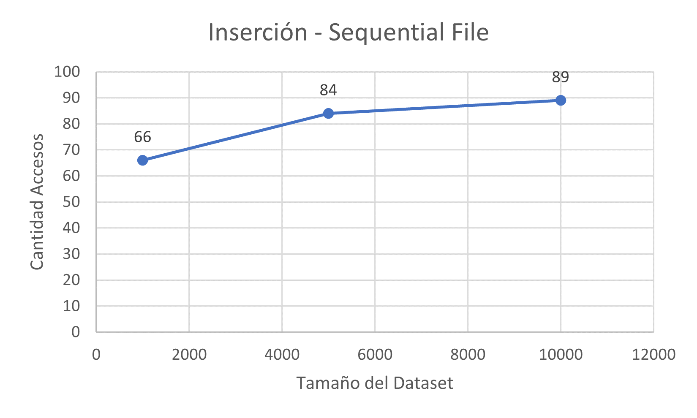

# Proyecto 1 - BD2

## Introducción

### Objetivo del proyecto
El objetivo principal de este proyecto es implementar y comparar dos técnicas de organización de archivos en memoria secundaria para almacenar y gestionar datos de manera eficiente. Las técnicas de organización de archivos seleccionadas son el Sequential File y Extendible Hashing. Para cada una de estas técnicas, se implementarán las principales operaciones de manipulación de datos, incluyendo búsqueda, búsqueda por rango, inserción y eliminación.

### Descripción del dominio de datos a usar
El proyecto utiliza un conjunto de datos llamado "Retail Data Set", que se encuentra disponible en [Kaggle](https://www.kaggle.com/datasets/shedai/retail-data-set).  Este conjunto de datos contiene información detallada sobre las transacciones de venta al por menor, principalmente de agencias de ventas, revendedores y sucursales de una empresa.

Debido a preocupaciones de privacidad, los identificadores de cliente, SKU y documentID han sido procesados con [LabelEncoder](https://scikit-learn.org/stable/modules/generated/sklearn.preprocessing.LabelEncoder.html), lo que significa que cada cliente y producto tiene un ID único en el archivo de datos. Es importante tener en cuenta que los datos abarcan más de tres años, y los precios de los productos pueden haber aumentado con el tiempo.

Los campos en el conjunto de datos incluyen:

- **DocumentID:** ID de la transacción. Una transacción puede contener múltiples registros para el mismo cliente en la misma fecha con múltiples productos (SKU). El DocumentID puede ser útil para combinar transacciones y detectar los artículos vendidos juntos.
- **Date:** Fecha de la transacción/venta. Está en formato de fecha y hora.
- **SKU:** Código del producto. El código único para cada artículo vendido.
- **Price:** Precio de venta de la transacción. El precio del producto para el cliente en la fecha dada.
- **Discount:** Monto del descuento para la transacción.
- **Customer:** ID único del cliente para cada cliente. En el conjunto de datos, el cliente puede ser un revendedor o una sucursal de la empresa.
- **Quantity:** Cantidad de artículos vendidos en la transacción.

El uso de este conjunto de datos permitirá analizar el rendimiento y la eficacia de las técnicas de organización de archivos implementadas en un entorno práctico y realista.

### Resultados que se esperan obtener
Al finalizar este proyecto, se espera obtener una implementación funcional y eficiente de las técnicas de organización de archivos Sequential File y Extendible Hashing. Estas implementaciones permitirán realizar comparaciones de rendimiento y eficiencia entre las dos técnicas, utilizando métricas como el tiempo de búsqueda, inserción y eliminación, así como el uso del espacio en disco.

## Sequential File

Esta técnica de organización de archivos consiste en almacenar
registros de manera ordenada en base a una llave específica en 
un archivo principal. Asimismo, los nuevos registros se insertarán 
en un archivo auxiliar manteniendo el orden de la llave mediante
punteros para finalmente unirlos.

### Load

Se lee el archivo csv con la libreria rapidcsv, donde cada linea representa
un registro de longitud fija y este registro es encapsulado por la estructura fixedRecord 
que tiene por atributos extras a `nextFile` y `nextPosition` que representan los 
punteros, para luego escribirlos en el archivo dataFile, que tiene un header
que apunta al registro con el menor valor de la llave.

### Insert

Esta función permite agregar registros manteniendo el orden de acuerdo a 
la llave, se tienen dos casos. El primero es cuando el archivo auxFile no ha 
llegado a su límite, se inserta al final de este y se actualizan los 
punteros manteniendo el orden. El segundo es cuando ya no hay espacio en auxFile y se necesita 
realizar una unión de archivos, con los punteros actualizados el archivo
resultante también estará ordenado, luego el último registro se inserta al 
final del auxFile como en el primer caso.

`Complejidad: O(log n + k)` 

### Search

Para esta función se ha implementado tanto la búsqueda única y la búsqueda 
por rango de los registros. Primero se verifica que exista la llave, luego
se procede a hacer la búsqueda binaria en el archivo dataFile y la búsqueda
secuencial en el archivo auxFile. Esto es mas sencillo porque utilizamos registros
con longitud fija.

`Complejidad: O(log n + k)`

### Remove

Esta funcion elimina registros manteniendo actualizados los punteros en los archivos. 
Primero se verifica que la llave exista, luego procedemos a actualizar los punteros 
del anterior registro a ser eliminado y marcamos el registro a ser eliminado en el campo `deleted`. 
Despues, procedemos a escribir los registros actualizados en los archivos dataFile y auxFile.

`Complejidad: O(log n + k)`

## Extendible Hash

Esta técnica de organización de archivos es un tipo de sistema de hash que trata 
un hash como una cadena de bits y utiliza un trie para la búsqueda de cubos. 
Debido a la naturaleza jerárquica del sistema, la re-hashing es una operación 
incremental (realizada un cubo a la vez, según sea necesario), lo que significa 
que las aplicaciones sensibles al tiempo se ven menos afectadas por el crecimiento 
de la tabla que por los rehashes completos estándar.

### Load

Se lee el archivo csv con la librería rapidcsv y luego se llama a
función insert para que cada registro se ubique dentro de su bucket
correspondiente en HashFile, tener en cuenta que cada bucket esta escrito
en la posición lógica de HashFile según su id. Asimismo, se crea
otro archivo llamado indexFile para saber más rápido cual es el tamaño
del sufijo a ser tomado para saber la id del bucket. 

### Insert

En esta función primero se realiza la función hash que en nuestro caso es módulo 
y se verifica en el indexFile de acuerdo a su valor cual es el tamaño del sufijo
a tomar para la id del Bucket, luego se encuentra el Bucket en el archivo
hashFile, a partir de esto tenemos 2 casos. El primero es cuando hay espacio en el
Bucket por lo que insertamos el registro en la posicion siguiente al ultimo registro.
El segundo caso sucede cuando el Bucket esta lleno donde tenemos que dividir nuestros 
registros y reorganizarlos de acuerdo a los nuevos hash de cadena de bits que se 
les agrega 1 o 0 al inicio de la cadena. Si ya no es posible hacer esta division 
porque llegamos al limite de nuestro globalDepth entonces procedemos a hacer 
encadenamiento de Buckets, cada Bucket agregado en el encadenamiento ira al final 
de todo el archivo HashFile.

`Complejidad: O(4 + 2 * (# de encadenamientos) + globalSize*2)`

### Search

Esta función permite buscar registros en Extendible Hashing. Primero, se calcula el valor de **indexKey**, se busca la entrada correspondiente en el archivo índice y se obtiene la clave hash de los últimos **lenLast** bits. Luego, se accede al bucket en el archivo de datos, y se crea un vector **result** para almacenar los registros que coincidan con la llave. La función busca dentro del bucket y en los siguientes si hay encadenamiento.

`Complejidad: O(n)`

### Remove

Esta funcion permite eliminar registros en Extendible Hashing. Primero, se calcula el valor del indexKey y se busca la entrada correspondiente en el archivo índice y se obtiene la clave hash de los últimos lenLast bits. Luego, se accede al bucket en el archivo de datos y se verifica que la key exista. Si eso ocurre, eliminamos el registro el cual estaba en esa posicion y decrementamos el tamaño del bucket en 1. Después, procedemos a hacer la escritura en los archivos. La función tambien busca en los buckets siguientes si hay encadenamiento.

`Complejidad: O(n)`

## Resultados

### Sequential File

Para la realización de experimentos, se creó datasets de tamaño 1000, 5000 y 10000. Los cuales están guardados en un archivo .csv
Asimismo, se realizo 5 operaciones para la inserción y la búsqueda.

### Tiempo de ejecución

Para la insercion del Sequential File se ejecuto 5 veces y se obtuvo el promedio de este, por cada dataset. Dando como resultado la siguiente gráfica.

Dataset | Tiempo (ms)
------------ | -------------
1000 | 22.8
5000 | 23.6
10000 | 45.2

Para la búsqueda del Sequential File se ejecuto 5 veces y se obtuvo el promedio de este, por cada dataset. Dando como resultado la siguiente gráfica.

Dataset | Tiempo (ms)
------------ | -------------
1000 | 3.6
5000 | 3.8
10000 | 4.4

### Accesos a memoria secundaria

Durante las pruebas, también se obtuvo la cantidad de accesos a disco. Asimismo, esto fue ejecutado en los diferentes datasets creados.
Para la inserción se obtuvo la siguiente gráfica.

Dataset | Total de accesos
------------ | -------------
1000 | 66
5000 | 84
10000 | 89

De la misma manera, la búsqueda obtuvo la siguiente gráfica.

Dataset | Total de accesos
------------ | -------------
1000 | 54
5000 | 67
10000 | 72

### Extendible Hash

Para la realización de experimentos, se creó datasets de tamaño 100, 500 y 1000. Los cuales están guardados en un archivo .csv

### Tiempo de ejecución

Para la inserción del Extendible Hash se realizaron cantidad de inserciones de acuerdo al tamaño del dataset.
Dando como resultado la siguiente tabla.

Dataset | Tiempo (ms)
------------ | -------------
100 | 282
500 | 2085
1000 | 5023

Para la búsqueda del Extendible Hash se realizaron cantidad de búsquedas de acuerdo al tamaño del dataset.
Dando como resultado la siguiente tabla.

Dataset | Tiempo (ms)
------------ | -------------
100 | 15
500 | 38
1000 | 69

### Accesos a memoria secundaria

Durante las pruebas, también se obtuvo la cantidad de accesos a disco. Asimismo, esto fue ejecutado en los diferentes datasets creados.
Para la inserción se obtuvo la siguiente tabla.

Dataset | Total de accesos
------------ | -------------
100 | 3140
500 | 6628
1000 | 14453

De la misma manera, la búsqueda obtuvo la siguiente tabla.

Dataset | Total de accesos
------------ | -------------
100 | 44
500 | 153
1000 | 230

## Conclusiones

* La inserciones y búsquedas en el indice Sequential File son bastante
eficientes para grandes cantidades de datos, ya que se realiza el 
algoritmo de la búsqueda binaria, además la eliminacion es muy sencilla
ya que solo se actualizan punteros, sin embargo se realiza
una cantidad lineal de operaciones para el merge que se realizará
de manera recurrente.

* La manera en como esta implementada el insert del Extendible Hash
es ineficiente debido a la gran cantidad de accesos a la memoria
secundaria que se utiliza para calcular el local depth, asimismo 
existe limitaciones con respecto al global depth, ya que el indice 
puede escribirse en un archivo muy grande de datos. Por otro lado,
búsqueda y eliminación se realizan de manera rápida y eficiente.
